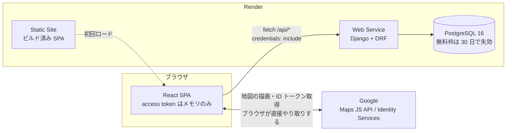
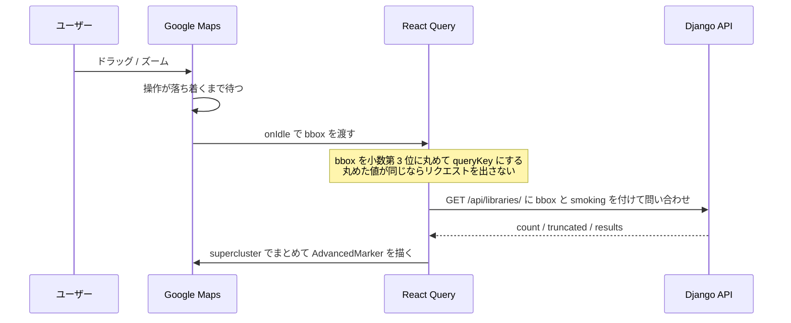
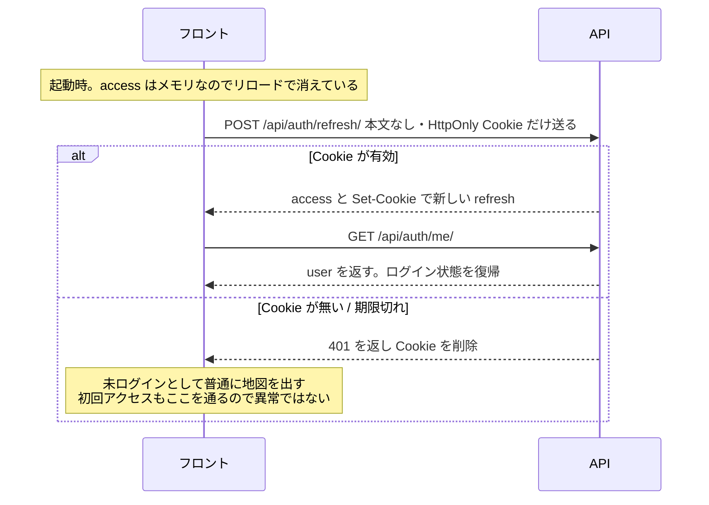

# django_prac — 東京都の図書館マップ

**React + Django + PostgreSQL + Docker + Render** を一通り手に馴染ませるための練習用リポジトリ。
東京都の図書館 490 件を地図で探し、お気に入りを登録できる。データは OpenStreetMap 由来。

> ⚠ **図書館に付いている「喫煙区分」は練習用のダミーデータ**で、実在する施設の喫煙可否とは
> 一切関係がない。**enum で表す複数状態のスキーマとフィルタ UI を練習するため**だけに
> 存在する値で、シード時に固定シードの擬似乱数で割り当てている。
> 画面上にもその旨を表示している。

React 19 / Vite 8 / TypeScript・Django 6.0 / DRF・PostgreSQL 16・Google Maps JS API。
バージョンと選定理由は [`docs/00-decisions.md`](docs/00-decisions.md)。

## デモ

| | |
|---|---|
| アプリ | <https://django-prac-web.onrender.com> |
| API のヘルスチェック | <https://django-prac-api.onrender.com/api/health/> |

> ⚠ **最初のアクセスは 1 分近く待つ。**
> 無料プランの Web Service は 15 分無操作でスリープするため、API を起こすのに
> **実測 44 秒**かかった。フロント（Static Site）は常に即座に開くので、
> **「地図は出るがピンが出ない・ログインできない」ときは API の起動待ち。**
> 上のヘルスチェックを開いて `{"status":"ok"}` が返ってからリロードする。
>
> 無料 Postgres は 30 日で失効するので、期限切れのタイミングだと
> データが空になっていることがある（[運用メモ](docs/10-roadmap.md)）。

---

## 構成



**フロントと API はホストが違う**（`django-prac-web.onrender.com` と `django-prac-api.onrender.com`）。

普通なら兄弟サブドメインは *same-site* 扱いで Cookie を共有できる。しかし
**`onrender.com` は Public Suffix List に載っている**ため、`onrender.com` 自体が
実効 TLD として扱われ、**登録可能ドメインがホスト全体**になる。
結果この 2 つは *cross-site* で、**Cookie を共有できない。**
これが認証の制約に直結する（後述）。

---

## 主要ロジック

### 1. 地図を動かすとピンが入れ替わる（メイン導線）



- `onIdle` は操作が落ち着いてから 1 回だけ発火する。**自前のデバウンスは要らない。**
- 丸めないと 1px 動かすたびに `queryKey` が変わってキャッシュが効かない。
- `limit` で打ち切られたら `truncated: true` を返し、画面に「拡大してください」を出す。
  黙って切ると「ズームアウトすると一部のピンが消える」という説明のつかない挙動になる。
- ピンのまとめ（クラスタ）は **API が返した緯度経度から**計算する。
  Google 公式の `@googlemaps/markerclusterer` は**地図に置いたマーカー側から座標を読む**作りで、
  それだと座標が入るより先に計算が走り、**クラスタが 1 つもできなかった。**
  そのため `supercluster` を直接使っている（経緯は [`docs/07-frontend.md`](docs/07-frontend.md)）。

### 2. ログイン状態の保持



- **access はレスポンス本文でもらってメモリに置く。** `localStorage` に置かない
  （同一オリジンの JS から全部読めるので、依存ライブラリ 1 つの汚染で持ち出される）。
- **refresh は HttpOnly Cookie**（`Path=/api/auth`）。本文には一切入れない。
- 通常のリクエストが 401 になったら **refresh → 1 回だけリトライ。** ループさせない。
- **refresh は同時に 1 本だけしか投げない**（single-flight）。ローテーションを有効にしてあるので、同時に 2 本投げると
  後から届いた方がブラックリスト済みの Cookie を使い、**正しいトークンまで無効化される。**
  React の StrictMode は effect を 2 回走らせるので、これが無いと開発中は必ず踏む。

### 3. 探して飛ぶ（検索 / 近い順）

地図のピンを絞り込むのは喫煙区分フィルタの役割で、**検索と「近い順」は「探して飛ぶ」導線。**
どちらも結果をクリックすると `map.panTo` でその館まで地図を動かす。

- **検索は `bbox` を送らない**（都全域が対象）。付けると八王子を見ながら「新宿」を検索して
  0 件になり、理由がユーザーに分からない。
- **カメラは制御にしない。** `center` / `zoom` を渡すと操作のたびに React へ戻ってきて地図が重くなる。
- 近い順は **bbox で粗く絞ってから haversine で距離を出す**（PostGIS は使わない）。
  bbox を先に掛けないと `(latitude, longitude)` の複合インデックスが使えない。
- ⚠ 距離を余弦定理（`acos`）で書くと**距離 0 付近で 500 になる。**
  実測と対処は [`docs/04-data-model.md`](docs/04-data-model.md)。

---

## 注意点

### 課金と鍵（Google Maps）

| | |
|---|---|
| 課金の単位 | **map load = 地図インスタンスの生成回数だけ。** ドラッグ・ズーム・タイル取得は課金されない |
| よくある誤解 | **タイルを CDN でキャッシュしても 1 円も安くならない**（課金対象でないため）。そのうえ Maps のコンテンツのキャッシュ・保存は**規約で禁止** |
| 鍵の守り方 | バンドルに埋まるので隠せない前提。Cloud Console で **HTTP リファラー制限 + Maps JavaScript API のみ + Quotas の日次上限**。リファラーは `curl` で偽装できるので、**請求を止められるのは日次上限だけ** |
| 節約できる唯一のレバー | 地図インスタンスを何回作るか。`reuseMaps` を付け、地図の無い画面に `APIProvider` を巻かない |

### 表示義務（守らないと規約違反）

- **OpenStreetMap（ODbL）の出典は自分で画面に出す。** 地図の無い画面（`/favorites`）にも出す。
- **Google のロゴと著作権表示を隠さない・重ねない。**
  375px で詳細パネルがロゴを覆う不具合を実際に踏んだ。

### 認証

- 上の「構成」のとおりフロントと API は *cross-site* なので、refresh Cookie は
  **third-party cookie** になる。つまり
  **Safari やサードパーティ Cookie ブロック下ではログインが維持されない。**
  独自ドメインを当てれば same-site になって解決するが、買わない判断をしたので受け入れている。
- 未ログインでも地図・一覧・詳細は見られる。**ログインを要求するのは書き込み（お気に入り）だけ。**

### 運用（無料プランの制約）

- **無料 Postgres は 30 日で失効する**（+14 日の猶予）。ユーザーアカウントは消える前提で運用する。
  作り直しの手順は [`docs/10-roadmap.md`](docs/10-roadmap.md)。
- **無料 Web Service は 15 分無操作でスリープする。** 人に見せる前に `/api/health/` を叩いて温める。
- **`VITE_*` はビルド時にバンドルへ埋まる。** Render 側で環境変数を入れてから再ビルドしないと反映されない。

### 開発

- **ホスト側のポートは既定値からずらしてある**（API `8001` / DB `5433`）。他プロジェクトと衝突しやすいため。
  コンテナ内の名前解決（`api:8000` / `db:5432`）は変わらない。
- **`main` はブランチ保護されている。** `feat/xxx` → PR → CI → Squash merge。
- **コミット前に `makemigrations --check` を通す。** モデルを変えたのにマイグレーションを
  作り忘れた変更を止めるため。
- 「イメージを作り直したのに中身が古い」→ **匿名ボリュームは `--build` では更新されない。**
  `docker compose up -d --renew-anon-volumes <service>`。
- 「直したのにブラウザに反映されない」→ **Vite の変換キャッシュ。** `docker compose restart web`。
  ハードリロードでは直らないので、これを知らないとコードを疑って時間を溶かす。

### データ

- 図書館 490 件は OpenStreetMap（Overpass API）由来。名称と座標は 100% 埋まっているが、
  **住所は 264 件しか入っていない。** 「名称・住所で検索」の住所側のヒット率はこれに依存する。
- 座標の出所は行ごとに `data_source` に残している。

---

## 動かす

```bash
cp .env.example .env    # GOOGLE_OAUTH_CLIENT_ID と GOOGLE_MAPS_API_KEY を入れる
docker compose up --build
docker compose exec api python manage.py migrate
docker compose exec api python manage.py loaddata libraries
# → http://localhost:5173
```

**Google Maps の API キーが無いと地図は出ない**（プレースホルダが表示される）。
キーの取得と制限の掛け方は [`docs/10-roadmap.md`](docs/10-roadmap.md) の Day 0。
地図を描かずに開発したいときは `VITE_MAP_ENABLED=0`。

コミット前に通すもの:

```bash
docker compose exec -T api ruff format . && docker compose exec -T api ruff check .
docker compose exec -T api python manage.py makemigrations --check --dry-run
docker compose exec -T api pytest -q
docker compose exec -T web npm run lint && docker compose exec -T web npm run build
```

---

## ドキュメント

**「なぜこうなっているのか」は全部 `docs/` にある。** 踏んだ落とし穴もそこに残している。

| # | ファイル | 内容 |
|---|---|---|
| 00 | [decisions](docs/00-decisions.md) | **確定バージョンと判断の根拠、変更履歴。まずここ** |
| 01 | [overview](docs/01-overview.md) | スコープ（Must / Won't） |
| 02 | [architecture](docs/02-architecture.md) | 全体構成、**ローカルと本番の差分表** |
| 03 | [local-dev](docs/03-local-dev.md) | docker compose、トラブルシュート |
| 04 | [data-model](docs/04-data-model.md) | ER 図、シードデータ、**距離計算の落とし穴** |
| 05 | [api](docs/05-api.md) | エンドポイント仕様 |
| 06 | [auth](docs/06-auth.md) | 認証設計 |
| 07 | [frontend](docs/07-frontend.md) | 画面構成、地図、**課金の単位** |
| 08 | [deploy-render](docs/08-deploy-render.md) | デプロイ手順と実際に踏んだ罠 |
| 09 | [ci-cd](docs/09-ci-cd.md) | GitHub Actions |
| 10 | [roadmap](docs/10-roadmap.md) | Day 0〜5 の進捗と運用メモ |

AI エージェント向けの共有ルールは [`AGENTS.md`](AGENTS.md)。
