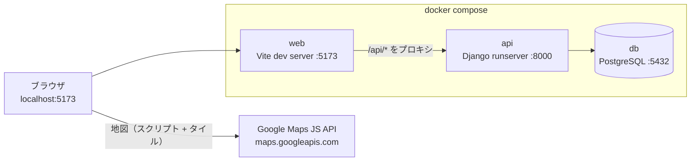
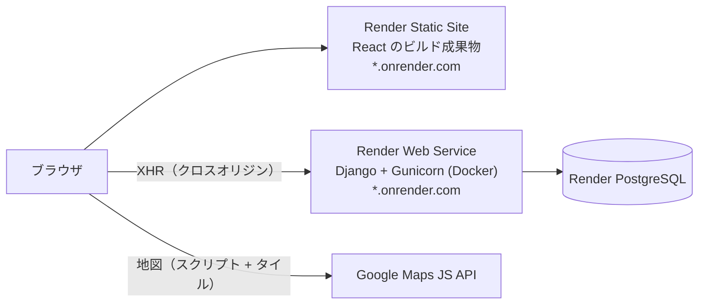

# 02. アーキテクチャ

## 全体構成

ローカルとデプロイ先で構造が**意図的に少し違う**。この違いを先に理解しておかないと、後で「ローカルでは動くのにデプロイすると CORS エラー」で時間を溶かすことになる。

### ローカル（`docker compose up`）



- ブラウザが見るのは **`localhost:5173` の一箇所だけ**。
- Vite dev server の `proxy` 設定が `/api/*` を `http://api:8000` に転送する。
- **同一オリジンなので CORS は発生しない。**

### デプロイ（Render）



- フロントと API が**別ホスト**になる → **CORS の設定が必須**。
- フロントは `VITE_API_BASE_URL` 環境変数で API の絶対 URL を受け取る。
- 静的サイトはスリープしないが、**無料の Web Service は 15 分アクセスがないとスリープする**（最初のリクエストが遅い）。詳細は `08-deploy-render.md`。

### 2 つの環境の差分 — ここが事故ポイント

| 項目 | ローカル | Render |
|---|---|---|
| フロントの配信 | Vite dev server | Static Site（ビルド成果物） |
| API の呼び出し先 | `/api/...`（相対パス、プロキシ） | `https://<api>.onrender.com/api/...`（絶対パス） |
| CORS | 不要 | **必要**（`django-cors-headers`） |
| Cookie | `SameSite=Lax` で足りる | **`SameSite=None; Secure` が必須**（クロスサイト） |
| HTTPS | なし | あり（Render が自動発行） |
| Django `DEBUG` | `True` | `False` |
| 静的ファイル（admin） | `runserver` が処理 | **WhiteNoise** |

> この表の 1 行 1 行が、実際のバグひとつずつに対応する。`08-deploy-render.md` のデプロイ用チェックリストで再確認する。

## コンテナ / サービス構成

| 名前 | ローカル | デプロイ | ベース |
|---|---|---|---|
| `db` | コンテナ | Render PostgreSQL（マネージド） | `postgres:16-alpine` |
| `api` | コンテナ（`runserver`） | Render Web Service（Docker、`gunicorn`） | `python:3.13-slim` |
| `web` | コンテナ（`vite dev`） | Render Static Site（`npm run build` → `dist/`） | `node:22-alpine` |

**`api` コンテナはローカルとデプロイで同じ `backend/Dockerfile` を使う。** 実行コマンドだけを変える（ローカルは compose の `command` で上書き）。フロントは性質が違うので、ローカル専用の `Dockerfile.dev` を別に置く。

## ディレクトリ構造

```
django_prac/
├── README.md
├── docs/                          # ← このドキュメント群
├── .env.example                   # 必要な環境変数の一覧（値は空）
├── docker-compose.yml
├── render.yaml                    # Render Blueprint（IaC）
│
├── backend/
│   ├── Dockerfile
│   ├── pyproject.toml             # 依存関係（uv もしくは pip-tools）
│   ├── manage.py
│   ├── config/                    # プロジェクト設定
│   │   ├── settings/
│   │   │   ├── base.py            # 共通
│   │   │   ├── local.py           # DEBUG=True、CORS はゆるめ
│   │   │   └── production.py      # DEBUG=False、セキュリティヘッダ、WhiteNoise
│   │   ├── urls.py
│   │   └── wsgi.py
│   ├── apps/
│   │   ├── accounts/              # User、SocialAccount、認証 API
│   │   │   ├── models.py
│   │   │   ├── serializers.py
│   │   │   ├── views.py
│   │   │   ├── urls.py
│   │   │   └── tests/
│   │   └── libraries/             # Library、Favorite、検索 API
│   │       ├── models.py
│   │       ├── serializers.py
│   │       ├── views.py
│   │       ├── urls.py
│   │       ├── management/commands/
│   │       │   ├── geocode_libraries.py   # CSV → 座標
│   │       │   └── seed_libraries.py      # fixture → DB
│   │       ├── fixtures/
│   │       │   └── libraries.json
│   │       └── tests/
│   └── data/
│       └── tokyo_libraries.csv    # 元データ（名称、住所）
│
├── frontend/
│   ├── Dockerfile.dev
│   ├── package.json
│   ├── vite.config.ts
│   ├── tsconfig.json
│   ├── index.html
│   └── src/
│       ├── main.tsx
│       ├── App.tsx
│       ├── api/                   # fetch ラッパ、トークン再発行のインターセプタ
│       ├── auth/                  # AuthContext、ログイン・登録フォーム、Google ボタン
│       ├── map/                   # MapView、マーカー、現在地、フィルタ
│       ├── components/
│       └── types/
│
└── .github/
    └── workflows/
        └── ci.yml                 # テスト → デプロイのトリガー
```

### なぜアプリを `apps/` の下に置くのか

Django 標準の `startapp` はプロジェクト直下にアプリを撒き散らす。アプリが 3〜4 個になるだけでルートが散らかるので、`backend/apps/` の下にまとめる。代わりに `INSTALLED_APPS` には `apps.accounts` の形で書き、作成時はディレクトリを先に掘ってから `python manage.py startapp accounts apps/accounts` とする。

## 設定の分割（`config/settings/`）

```python
# config/settings/base.py  （概念のスケッチ）
import os
from pathlib import Path

import dj_database_url

BASE_DIR = Path(__file__).resolve().parent.parent.parent

SECRET_KEY = os.environ["DJANGO_SECRET_KEY"]
INSTALLED_APPS = [
    ...,
    "rest_framework",
    "corsheaders",
    "apps.accounts",
    "apps.libraries",
]
AUTH_USER_MODEL = "accounts.User"
DATABASES = {"default": dj_database_url.config(conn_max_age=600)}  # DATABASE_URL をパース
```

- `DJANGO_SETTINGS_MODULE` 環境変数で `config.settings.local` / `config.settings.production` を切り替える。
- **DB の接続情報は `DATABASE_URL` ひとつに統一する。** Render がその形式で払い出してくるので、ローカルの compose でも同じ変数を渡してやればコード側の分岐が消える。`dj-database-url` パッケージを使う。

## 主な依存関係（たたき台）

### backend

| パッケージ | 用途 |
|---|---|
| `django` | 本体 |
| `djangorestframework` | REST API |
| `djangorestframework-simplejwt` | JWT の発行・更新 |
| `django-cors-headers` | CORS |
| `dj-database-url` | `DATABASE_URL` のパース |
| `psycopg[binary]` | PostgreSQL ドライバ（v3） |
| `gunicorn` | デプロイ用 WSGI サーバ |
| `whitenoise` | Django admin の静的ファイル |
| `google-auth` | Google ID トークンの検証 |
| `python-dotenv` | ローカルの `.env` 読み込み（任意） |
| `pytest` + `pytest-django` | テスト（dev グループ） |
| `ruff` | Lint + フォーマット（dev グループ） |

### frontend

| パッケージ | 用途 |
|---|---|
| `react`, `react-dom` | 本体 |
| `react-router` | ルーティング |
| `@vis.gl/react-google-maps` | Google Maps JS API の React ラッパ（`@types/google.maps` を同梱） |
| `supercluster` | マーカーのクラスタリング。**マーカー要素ではなく API の座標から計算する**（理由は `07-frontend.md`） |
| `@tanstack/react-query` | サーバ状態のキャッシュ（地図を動かすたびに再取得するので効く） |
| `zod` | API レスポンスの検証（任意だが推奨） |
| `typescript`, `vite`, `@vitejs/plugin-react` | ビルド |
| `oxlint` | Lint + フォーマット。**create-vite の既定**（eslint / prettier は使わない） |

> 状態管理ライブラリ（Redux / Zustand）は入れない。この規模なら `useState` と React Query で足り、無いほうが練習の邪魔にならない。

## データの流れ（一行ずつ）

1. ブラウザが地図を表示し、現在地を要求する（拒否されたら東京駅の座標にフォールバック）。
2. 地図の表示範囲（bbox）が変わるたびに `GET /api/libraries/?bbox=...&smoking=...` を呼ぶ。
3. Django が緯度経度の範囲条件で検索し、JSON を返す。
4. フロントがマーカーを差し替える。マーカーをクリックすると詳細パネルを開く。
5. 地図のスクリプトとタイルはブラウザが**Google から直接**取得する（自分のサーバを経由しない）。
   そのため **API キーはブラウザに出る**前提で、Cloud Console 側のリファラー制限で守る（`00-decisions.md`）。
