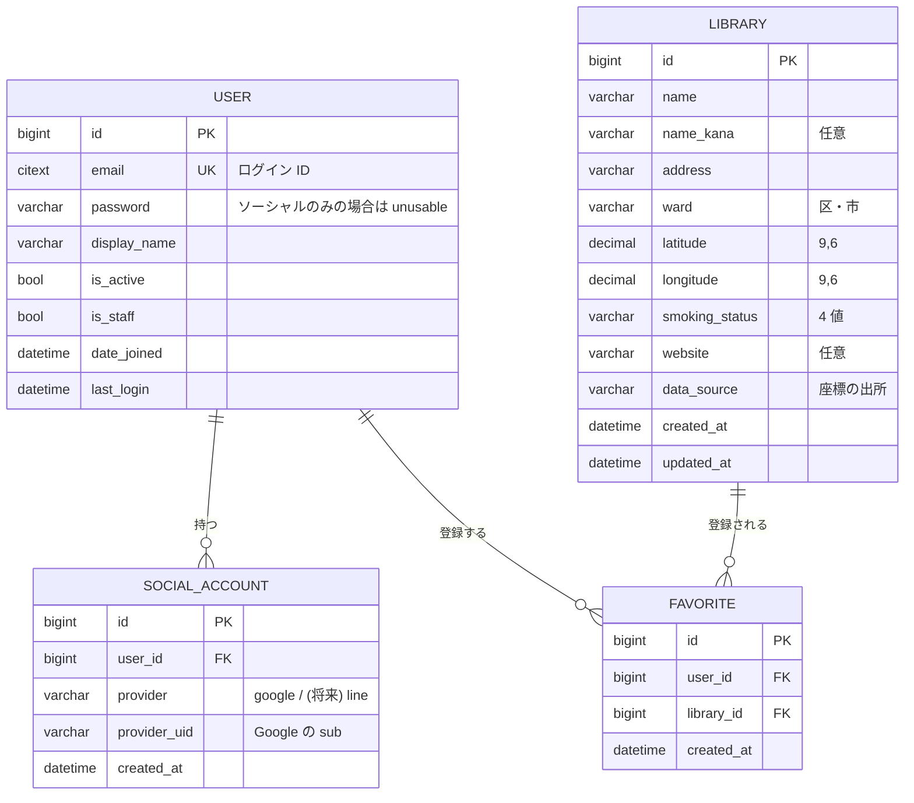

# 04. データモデルとシードデータ

## ER 図



## モデル定義

### `apps/accounts/models.py`

```python
class User(AbstractBaseUser, PermissionsMixin):
    email = models.EmailField(unique=True)
    display_name = models.CharField(max_length=50, blank=True)
    is_active = models.BooleanField(default=True)
    is_staff = models.BooleanField(default=False)
    date_joined = models.DateTimeField(auto_now_add=True)

    USERNAME_FIELD = "email"
    REQUIRED_FIELDS = []

    objects = UserManager()


class SocialAccount(models.Model):
    class Provider(models.TextChoices):
        GOOGLE = "google", "Google"
        # LINE = "line", "LINE"   # スコープ外。追加するならここ

    user = models.ForeignKey(User, on_delete=models.CASCADE, related_name="social_accounts")
    provider = models.CharField(max_length=20, choices=Provider.choices)
    provider_uid = models.CharField(max_length=255)
    created_at = models.DateTimeField(auto_now_add=True)

    class Meta:
        constraints = [
            models.UniqueConstraint(
                fields=["provider", "provider_uid"], name="uniq_provider_uid"
            )
        ]
```

**設計の意図**

- **`username` を捨てて `email` を `USERNAME_FIELD` にする。** Django のデフォルト User をそのまま使うと、Google ログインのときに埋めようのない `username` が邪魔になる。**カスタム User はマイグレーションを 1 本でも走らせた後だと差し替えが極めて面倒**なので、`Day 1` の最初、`migrate` を打つ前に必ず作ること。
- **ソーシャル連携を `User` のカラムにせず別テーブルにする。** `google_id` カラムを生やす設計にすると、LINE を足すときに `line_id` を足すことになり、プロバイダが増えるたびにスキーマが変わる。`SocialAccount` を分けておけば行が増えるだけで済む。
- **1 ユーザーが ID/PW と Google の両方を持てる。** 同じメールで Google ログインしたら、新規作成ではなく既存ユーザーに `SocialAccount` を紐付ける（`06-auth.md` のアカウント紐付けを参照）。
- パスワードを持たないユーザー（Google のみ）は `set_unusable_password()` にしておく。

### `apps/libraries/models.py`

```python
class SmokingStatus(models.TextChoices):
    NONE          = "none",          "喫煙不可"
    HEATED_ONLY   = "heated_only",   "加熱式のみ可"
    CIGARETTE_ONLY= "cigarette_only","紙巻きのみ可"
    BOTH          = "both",          "両方可"


class Library(models.Model):
    name          = models.CharField(max_length=120)
    name_kana     = models.CharField(max_length=160, blank=True)
    address       = models.CharField(max_length=255)
    ward          = models.CharField(max_length=40, db_index=True)
    latitude      = models.DecimalField(max_digits=9, decimal_places=6)
    longitude     = models.DecimalField(max_digits=9, decimal_places=6)
    smoking_status= models.CharField(
        max_length=20, choices=SmokingStatus.choices, db_index=True
    )
    website       = models.URLField(blank=True)
    data_source   = models.CharField(max_length=40, default="gsi_geocoding")
    created_at    = models.DateTimeField(auto_now_add=True)
    updated_at    = models.DateTimeField(auto_now=True)

    class Meta:
        indexes = [models.Index(fields=["latitude", "longitude"])]
        constraints = [
            models.UniqueConstraint(fields=["name", "address"], name="uniq_library_name_address"),
        ]


class Favorite(models.Model):
    user       = models.ForeignKey(User, on_delete=models.CASCADE, related_name="favorites")
    library    = models.ForeignKey(Library, on_delete=models.CASCADE, related_name="favorites")
    created_at = models.DateTimeField(auto_now_add=True)

    class Meta:
        constraints = [
            models.UniqueConstraint(fields=["user", "library"], name="uniq_user_library")
        ]
```

**設計の意図**

- **座標は `FloatField` ではなく `DecimalField(9, 6)`。** 小数 6 桁 ≒ 約 11cm の分解能で、日本国内の用途には十分。浮動小数の丸め誤差で `uniq` 判定や差分比較が揺れるのを避ける。
- **`smoking_status` は boolean 2 本ではなく単一の enum。** 「加熱式のみ可」「紙巻きのみ可」を boolean 2 本（`allow_heated` / `allow_cigarette`）で表すこともできるが、元プロジェクトの仕様書でも「単純な boolean では表現できない」と整理されている。フィルタ UI が enum のほうが素直に書ける。
- **`(name, address)` に UNIQUE 制約。** シード投入スクリプトを 2 回叩いても重複しないようにする（upsert のキー）。
- **`data_source` を持つ。** 座標をどこから取ったかを行ごとに残す。元プロジェクトで Google Maps 由来の座標に保持期限の制約があった件と同じ発想で、**出所を後から追えるようにしておく**習慣をここで付けておく。今回は `gsi_geocoding` / `manual` / `osm` あたり。

## 喫煙区分のランダム割り当てについて

**実際の図書館は当然すべて禁煙である。** このフィールドは元ドメイン（喫煙可能店マッチング）のスキーマとフィルタ UI を練習するためだけに存在する。

- シード生成時に、固定シード値の擬似乱数で 4 値のいずれかを割り当てる（`random.Random(42)` のように seed を固定し、再生成しても同じ結果になるようにする）。
- **UI 上に「このデータは練習用のダミーです」と明示する。** 詳細パネルの喫煙区分の横に注記を出す。実在施設に誤った情報を紐付けたまま公開する状態にはしない。
- 分布は均等でなくてよい（例: 不可 40% / 加熱式のみ 25% / 紙巻きのみ 15% / 両方 20%）。フィルタの動作確認ができればよい。

## シードデータの作り方

**座標を手で書かない。** 実在の施設名に、確認していない緯度経度をでっち上げて commit すると、あとで「なんとなく合っている座標」がリポジトリに残り続ける。次の 3 段階で作る。

### Step 1. 名称と住所の CSV を用意する — `backend/data/tokyo_libraries.csv`

```csv
name,ward,address,website
東京都立中央図書館,港区,,
千代田区立日比谷図書文化館,千代田区,,
新宿区立中央図書館,新宿区,,
...
```

- 対象は**東京都の主要な区立・市立の中央図書館 30〜50 件**。
- `address` は各図書館の公式サイトから転記する（ここは人力。30 件なら 30 分程度）。
- 出典として `website` に公式ページの URL を入れておくと、後で検証しやすい。

候補（中央館クラス、区部を中心に）:

<details>
<summary>図書館名リスト（たたき台・住所は要記入）</summary>

都立: 東京都立中央図書館 / 東京都立多摩図書館

区部: 千代田区立日比谷図書文化館 / 中央区立京橋図書館 / 港区立みなと図書館 / 新宿区立中央図書館 / 文京区立真砂中央図書館 / 台東区立中央図書館 / 墨田区立ひきふね図書館 / 江東区立江東図書館 / 品川区立品川図書館 / 目黒区立目黒本町図書館 / 大田区立大田図書館 / 世田谷区立中央図書館 / 渋谷区立中央図書館 / 中野区立中央図書館 / 杉並区立中央図書館 / 豊島区立中央図書館 / 北区立中央図書館 / 荒川区立中央図書館 / 板橋区立中央図書館 / 練馬区立光が丘図書館 / 足立区立中央図書館 / 葛飾区立中央図書館 / 江戸川区立中央図書館

市部: 武蔵野市立中央図書館 / 三鷹市立三鷹図書館 / 八王子市中央図書館 / 立川市中央図書館 / 府中市立中央図書館 / 調布市立中央図書館 / 町田市立中央図書館 / 小平市立中央図書館 / 日野市立中央図書館 / 西東京市立中央図書館

> 名称は改称・移転がありうる。CSV に落とす前に各自治体の公式ページで現行名称を確認すること。

</details>

### Step 2. ジオコーディングして座標を埋める — `geocode_libraries`

国土地理院の住所検索 API を使う。**API キー不要・無料**で、日本の住所に特化している。

```
GET https://msearch.gsi.go.jp/address-search/AddressSearch?q=<住所>
→ GeoJSON。features[0].geometry.coordinates が [経度, 緯度]
```

```bash
docker compose exec api python manage.py geocode_libraries \
    --input data/tokyo_libraries.csv \
    --output apps/libraries/fixtures/libraries.json \
    --dry-run
```

コマンドの要件:

- 1 件ずつ順に問い合わせ、**リクエスト間に 1 秒のスリープを入れる**（公共 API への礼儀。30 件なら 30 秒で終わる）
- 結果が 0 件、または座標が東京都の想定範囲（およそ 緯度 35.5〜35.9 / 経度 138.9〜139.9）から外れたら**その行を採用せず警告を出す**。黙って変な座標を入れない
- `--dry-run` で件数と失敗行だけを表示し、ファイルは書かない
- `smoking_status` はこの段階で固定シードの乱数で割り当てる
- `data_source` に `gsi_geocoding` を入れる。手で直した行は `manual` に変える

**生成された `libraries.json` は commit する。** 毎回ジオコーディングを走らせなくても `loaddata` だけで環境が再現できるようにするため。

### Step 3. 投入

```bash
docker compose exec api python manage.py loaddata libraries
```

fixture の形（Django 標準形式）:

```json
[
  {
    "model": "libraries.library",
    "pk": 1,
    "fields": {
      "name": "東京都立中央図書館",
      "name_kana": "",
      "address": "（CSV から）",
      "ward": "港区",
      "latitude": "35.xxxxxx",
      "longitude": "139.xxxxxx",
      "smoking_status": "none",
      "website": "",
      "data_source": "gsi_geocoding",
      "created_at": "2026-08-03T00:00:00Z",
      "updated_at": "2026-08-03T00:00:00Z"
    }
  }
]
```

> `loaddata` は pk を固定するので冪等に近い挙動になる。何度流しても行は増えない。

## 検索クエリの方針

### bbox 検索（メイン導線）

地図の表示範囲だけを取る。PostGIS は使わず、素直な範囲条件で書く。

```python
qs = Library.objects.filter(
    latitude__gte=min_lat, latitude__lte=max_lat,
    longitude__gte=min_lng, longitude__lte=max_lng,
)
if smoking:                       # 複数指定可
    qs = qs.filter(smoking_status__in=smoking)
qs = qs[:LIMIT]                   # LIMIT は 500 程度
```

`(latitude, longitude)` の複合インデックスが効く。数十件〜数千件の規模ならこれで十分速い。

### 近い順（Should 機能）

Haversine を SQL 側で計算する。ORM で書くなら `RawSQL` か `Func` を使う。

```sql
-- 概念。実装時は必ずプレースホルダでバインドする
SELECT *,
       6371000 * acos(
         cos(radians(%(lat)s)) * cos(radians(latitude)) *
         cos(radians(longitude) - radians(%(lng)s)) +
         sin(radians(%(lat)s)) * sin(radians(latitude))
       ) AS distance_m
FROM libraries_library
WHERE latitude BETWEEN %(min_lat)s AND %(max_lat)s   -- ← 先に bbox で絞る（重要）
  AND longitude BETWEEN %(min_lng)s AND %(max_lng)s
ORDER BY distance_m
LIMIT 50;
```

**必ず bbox で絞ってから距離計算する。** いきなり全行に対して三角関数を回すとインデックスが使えない。

### PostGIS へのアップグレード経路（今回はやらない）

将来、件数が数万件に増えて上記が苦しくなったら:

1. Postgres に `CREATE EXTENSION postgis;`（Render の Postgres でも有効化できる）
2. Docker イメージに GDAL / GEOS / PROJ を追加インストール
3. `django.contrib.gis` を `INSTALLED_APPS` に追加、`ENGINE` を `django.contrib.gis.db.backends.postgis` に変更
4. `location = models.PointField(geography=True, srid=4326)` を追加するマイグレーション → 既存の緯度経度から値を埋めるデータマイグレーション → GiST インデックス作成
5. 検索を `ST_DWithin` / `ST_Distance` に置き換え

緯度経度カラムは残しておけば API のレスポンス形式を変えずに済む。**この 5 手順が想像できていれば、今 PostGIS を入れない判断は妥当。**

## Django Admin

管理画面は作り込まないが、データ確認用に最低限を設定しておくと `docker compose exec ... shell` を打つ回数が減る。

```python
@admin.register(Library)
class LibraryAdmin(admin.ModelAdmin):
    list_display  = ("name", "ward", "smoking_status", "latitude", "longitude", "data_source")
    list_filter   = ("ward", "smoking_status", "data_source")
    search_fields = ("name", "address")
```
