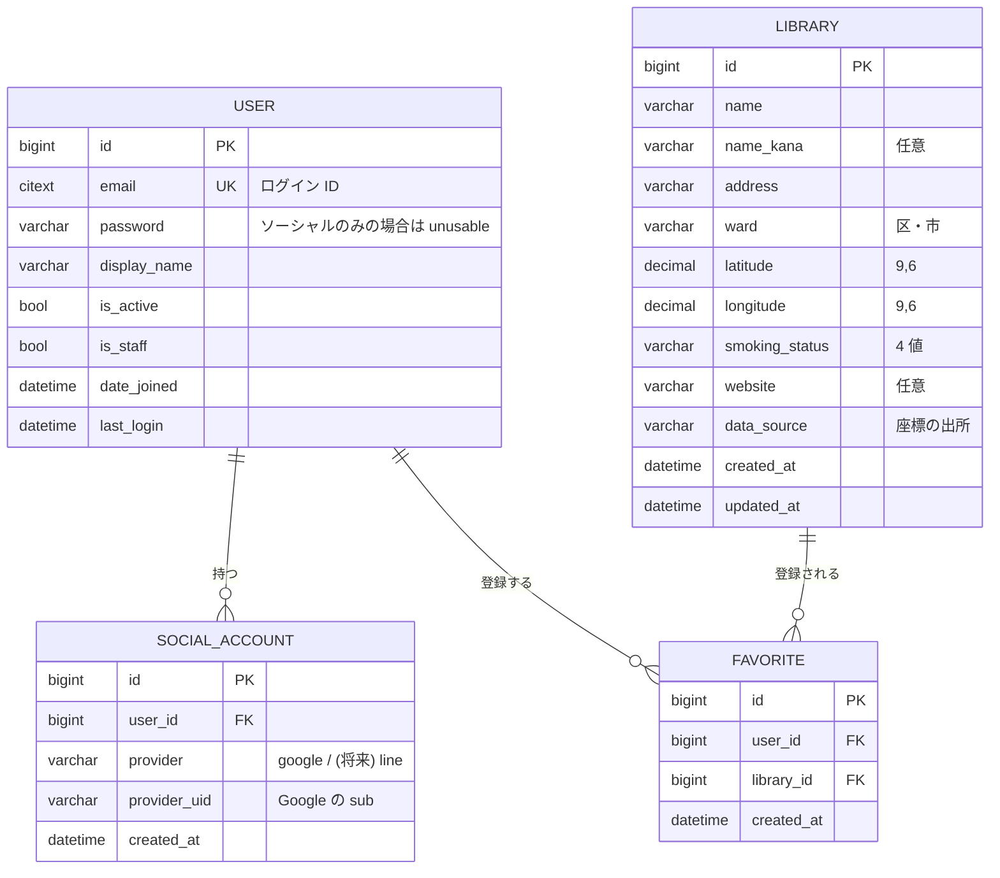

# 04. データモデルとシードデータ

## ER 図



## モデル定義

### `apps/accounts/models.py`

```python
class User(AbstractBaseUser, PermissionsMixin):
    email = models.EmailField(unique=True)
    display_name = models.CharField(max_length=50, blank=True)
    is_active = models.BooleanField(default=True)
    is_staff = models.BooleanField(default=False)
    date_joined = models.DateTimeField(auto_now_add=True)

    USERNAME_FIELD = "email"
    REQUIRED_FIELDS = []

    objects = UserManager()


class SocialAccount(models.Model):
    class Provider(models.TextChoices):
        GOOGLE = "google", "Google"
        # LINE = "line", "LINE"   # スコープ外。追加するならここ

    user = models.ForeignKey(User, on_delete=models.CASCADE, related_name="social_accounts")
    provider = models.CharField(max_length=20, choices=Provider.choices)
    provider_uid = models.CharField(max_length=255)
    created_at = models.DateTimeField(auto_now_add=True)

    class Meta:
        constraints = [
            models.UniqueConstraint(
                fields=["provider", "provider_uid"], name="uniq_provider_uid"
            )
        ]
```

**設計の意図**

- **`username` を捨てて `email` を `USERNAME_FIELD` にする。** Django のデフォルト User をそのまま使うと、Google ログインのときに埋めようのない `username` が邪魔になる。**カスタム User はマイグレーションを 1 本でも走らせた後だと差し替えが極めて面倒**なので、`Day 1` の最初、`migrate` を打つ前に必ず作ること。
- **ソーシャル連携を `User` のカラムにせず別テーブルにする。** `google_id` カラムを生やす設計にすると、LINE を足すときに `line_id` を足すことになり、プロバイダが増えるたびにスキーマが変わる。`SocialAccount` を分けておけば行が増えるだけで済む。
- **1 ユーザーが ID/PW と Google の両方を持てる。** 同じメールで Google ログインしたら、新規作成ではなく既存ユーザーに `SocialAccount` を紐付ける（`06-auth.md` のアカウント紐付けを参照）。
- パスワードを持たないユーザー（Google のみ）は `set_unusable_password()` にしておく。

### `apps/libraries/models.py`

```python
class SmokingStatus(models.TextChoices):
    NONE          = "none",          "喫煙不可"
    HEATED_ONLY   = "heated_only",   "加熱式のみ可"
    CIGARETTE_ONLY= "cigarette_only","紙巻きのみ可"
    BOTH          = "both",          "両方可"


class Library(models.Model):
    name          = models.CharField(max_length=120)
    name_kana     = models.CharField(max_length=160, blank=True)
    address       = models.CharField(max_length=255)
    ward          = models.CharField(max_length=40, db_index=True)
    latitude      = models.DecimalField(max_digits=9, decimal_places=6)
    longitude     = models.DecimalField(max_digits=9, decimal_places=6)
    smoking_status= models.CharField(
        max_length=20, choices=SmokingStatus.choices, db_index=True
    )
    website       = models.URLField(max_length=300, blank=True)
    osm_id        = models.CharField(max_length=32, blank=True, db_index=True)
    data_source   = models.CharField(
        max_length=20, choices=DataSource.choices, default=DataSource.OSM_OVERPASS
    )
    created_at    = models.DateTimeField(auto_now_add=True)
    updated_at    = models.DateTimeField(auto_now=True)

    class Meta:
        ordering = ["id"]
        indexes = [models.Index(fields=["latitude", "longitude"], name="idx_library_latlng")]
        constraints = [
            models.UniqueConstraint(
                fields=["name", "latitude", "longitude"], name="uniq_library_spot"
            ),
        ]


class Favorite(models.Model):
    user       = models.ForeignKey(User, on_delete=models.CASCADE, related_name="favorites")
    library    = models.ForeignKey(Library, on_delete=models.CASCADE, related_name="favorites")
    created_at = models.DateTimeField(auto_now_add=True)

    class Meta:
        constraints = [
            models.UniqueConstraint(fields=["user", "library"], name="uniq_user_library")
        ]
```

**設計の意図**

- **座標は `FloatField` ではなく `DecimalField(9, 6)`。** 小数 6 桁 ≒ 約 11cm の分解能で、日本国内の用途には十分。浮動小数の丸め誤差で `uniq` 判定や差分比較が揺れるのを避ける。
- **`smoking_status` は boolean 2 本ではなく単一の enum。** 「加熱式のみ可」「紙巻きのみ可」を boolean 2 本（`allow_heated` / `allow_cigarette`）で表すこともできるが、元プロジェクトの仕様書でも「単純な boolean では表現できない」と整理されている。フィルタ UI が enum のほうが素直に書ける。
- **UNIQUE 制約は `(name, address)` ではなく `(name, latitude, longitude)`。**
  当初は住所をキーにする想定だったが、実データでは**住所の充足率が 54% しかなかった**（後述）。
  空文字が多いカラムを一意キーに含めると、別々の施設が衝突する。座標なら 100% 埋まっている。
- **`data_source` を持つ。** 座標をどこから取ったかを行ごとに残す。元プロジェクトで Google Maps 由来の座標に保持期限の制約があった件と同じ発想で、**出所を後から追えるようにしておく**習慣をここで付けておく。実装では `osm_overpass` / `gsi_reverse` / `manual` の 3 値。
- **`osm_id` を持つ。** OpenStreetMap 側の要素 ID（`node/416335894`）。元データを引き直したいときに追える。

## 喫煙区分のランダム割り当てについて

**実際の図書館は当然すべて禁煙である。** このフィールドは元ドメイン（喫煙可能店マッチング）のスキーマとフィルタ UI を練習するためだけに存在する。

- シード生成時に、固定シード値の擬似乱数で 4 値のいずれかを割り当てる（`random.Random(42)` のように seed を固定し、再生成しても同じ結果になるようにする）。
- **UI 上に「このデータは練習用のダミーです」と明示する。** 詳細パネルの喫煙区分の横に注記を出す。実在施設に誤った情報を紐付けたまま公開する状態にはしない。
- 分布は均等でなくてよい（例: 不可 40% / 加熱式のみ 25% / 紙巻きのみ 15% / 両方 20%）。フィルタの動作確認ができればよい。

## シードデータの作り方

> **⚠ この節は実装時に方針を変更した。** 当初は「名称と住所の CSV を人力で作り、
> 国土地理院の住所検索で座標を引く」計画だったが、実際に調べたところ
> **OpenStreetMap に東京都の図書館が 490 件、名称と座標が 100% 揃った状態**で
> 存在したため、そちらに切り替えた。
>
> 当初 CSV 方式を採った理由は「確認していない座標をでっち上げないため」だったが、
> 実測値をそのまま使う OSM のほうがその原則をより満たす。人力の CSV 作成（30 件で 30 分）も不要になった。

### 出所

| 項目 | 出所 | 充足率 |
|---|---|---|
| 名称・緯度経度 | **OpenStreetMap**（Overpass API） | 100%（490 件） |
| website | 同上 | 20% |
| 住所 | 同上（`addr:full` ほか） | 54% |
| 区市町村 | `addr:city` → 名称から推定 → **国土地理院 逆ジオコーディング** | **100%**（66 種類） |
| 喫煙区分 | 固定シードの擬似乱数 | **★ ダミー** |

**★ OpenStreetMap のデータは ODbL。出典表示が義務**なので、UI に必ず明記する。

### 区市町村を 3 段階で埋める理由

OSM の住所タグは充足率が低い（`addr:city` は 25%）。一方、日本の公立図書館は
**名称に自治体名が入っている**ことが多い（「北区立中央図書館」→「北区」）。

```
① addr:city がある                    126 件 (25%)
② 名称の先頭から推定  ^(.+?[区市町村])   255 件 (52%)
③ 残りを国土地理院の逆ジオコーディング    109 件 (22%)
                                    ─────────────
                                    490 件 (100%)
```

③ は `muniCd`（自治体コード）を返すので、国土地理院が公開する
[`muni.js`](https://maps.gsi.go.jp/js/muni.js) の対応表で名称に変換する（`13101` → `千代田区`）。

**③ だけで全件やらないのは、公共 API に 490 回叩く必要がないから。** ①② で 78% が
埋まるので、残り 109 件・約 2 分で済む。

### 実行

```bash
# まず件数と警告だけ確認（ファイルは書かない）
docker compose exec api python manage.py fetch_libraries --dry-run --skip-reverse

# 本番実行（逆ジオコーディングを含むので 2 分ほどかかる）
docker compose exec api python manage.py fetch_libraries

# 投入
docker compose exec api python manage.py loaddata libraries
```

### コマンドの設計上の決めごと

| 決めごと | 理由 |
|---|---|
| **Overpass のミラーを 3 つ順に試す** | 公開インスタンスは混雑すると 429 / 504 を返す。実際に開発中 1 回踏んだ |
| **逆ジオコーディングは 1 件 1 秒スリープ** | 公共 API への礼儀 |
| **東京都の想定範囲外の座標は採用せず警告** | 黙って変な座標を入れない |
| **`--dry-run` を用意** | 件数と失敗行だけ見てからファイルを書く |
| **`created_at` / `updated_at` を fixture に含める** | `loaddata` は `save_base(raw=True)` で保存するため `auto_now_add` が効かない。**入れないと NOT NULL 違反で落ちる** |
| **タイムスタンプは固定値** | `timezone.now()` にすると再生成のたびに全 490 行の diff が出る |
| **喫煙区分は固定シードの乱数** | 再生成しても同じ結果になる |

**生成した `libraries.json` は commit する。** 毎回 API を叩かなくても `loaddata` だけで
環境を再現できるようにするため。無料 Postgres が 30 日で消えたときの復旧手段でもある。

### 伊豆・小笠原諸島について

東京都は**伊豆諸島・小笠原諸島まで含む**。取得結果の最南端は緯度 32.46（青ヶ島）で、
これは誤りではない。

そのため `TOKYO_BOUNDS` は都心だけでなく島嶼部を含む広い範囲にしてある。
一方で地図の初期表示は東京駅中心なので、島の図書館は bbox から自然に外れる。
**この挙動はテストで固定してある**（`test_bbox_excludes_izu_islands`）。

## 検索クエリの方針

### bbox 検索（メイン導線）

地図の表示範囲だけを取る。PostGIS は使わず、素直な範囲条件で書く。

```python
qs = Library.objects.filter(
    latitude__gte=min_lat, latitude__lte=max_lat,
    longitude__gte=min_lng, longitude__lte=max_lng,
)
if smoking:                       # 複数指定可
    qs = qs.filter(smoking_status__in=smoking)
qs = qs[:LIMIT]                   # LIMIT は 500 程度
```

`(latitude, longitude)` の複合インデックスが効く。数十件〜数千件の規模ならこれで十分速い。

### 近い順（Should 機能）

Haversine を SQL 側で計算する。ORM で書くなら `RawSQL` か `Func` を使う。

```sql
-- 概念。実装時は必ずプレースホルダでバインドする
SELECT *,
       6371000 * acos(
         cos(radians(%(lat)s)) * cos(radians(latitude)) *
         cos(radians(longitude) - radians(%(lng)s)) +
         sin(radians(%(lat)s)) * sin(radians(latitude))
       ) AS distance_m
FROM libraries_library
WHERE latitude BETWEEN %(min_lat)s AND %(max_lat)s   -- ← 先に bbox で絞る（重要）
  AND longitude BETWEEN %(min_lng)s AND %(max_lng)s
ORDER BY distance_m
LIMIT 50;
```

**必ず bbox で絞ってから距離計算する。** いきなり全行に対して三角関数を回すとインデックスが使えない。

### PostGIS へのアップグレード経路（今回はやらない）

将来、件数が数万件に増えて上記が苦しくなったら:

1. Postgres に `CREATE EXTENSION postgis;`（Render の Postgres でも有効化できる）
2. Docker イメージに GDAL / GEOS / PROJ を追加インストール
3. `django.contrib.gis` を `INSTALLED_APPS` に追加、`ENGINE` を `django.contrib.gis.db.backends.postgis` に変更
4. `location = models.PointField(geography=True, srid=4326)` を追加するマイグレーション → 既存の緯度経度から値を埋めるデータマイグレーション → GiST インデックス作成
5. 検索を `ST_DWithin` / `ST_Distance` に置き換え

緯度経度カラムは残しておけば API のレスポンス形式を変えずに済む。**この 5 手順が想像できていれば、今 PostGIS を入れない判断は妥当。**

## Django Admin

管理画面は作り込まないが、データ確認用に最低限を設定しておくと `docker compose exec ... shell` を打つ回数が減る。

```python
@admin.register(Library)
class LibraryAdmin(admin.ModelAdmin):
    list_display  = ("name", "ward", "smoking_status", "latitude", "longitude", "data_source")
    list_filter   = ("ward", "smoking_status", "data_source")
    search_fields = ("name", "address")
```
