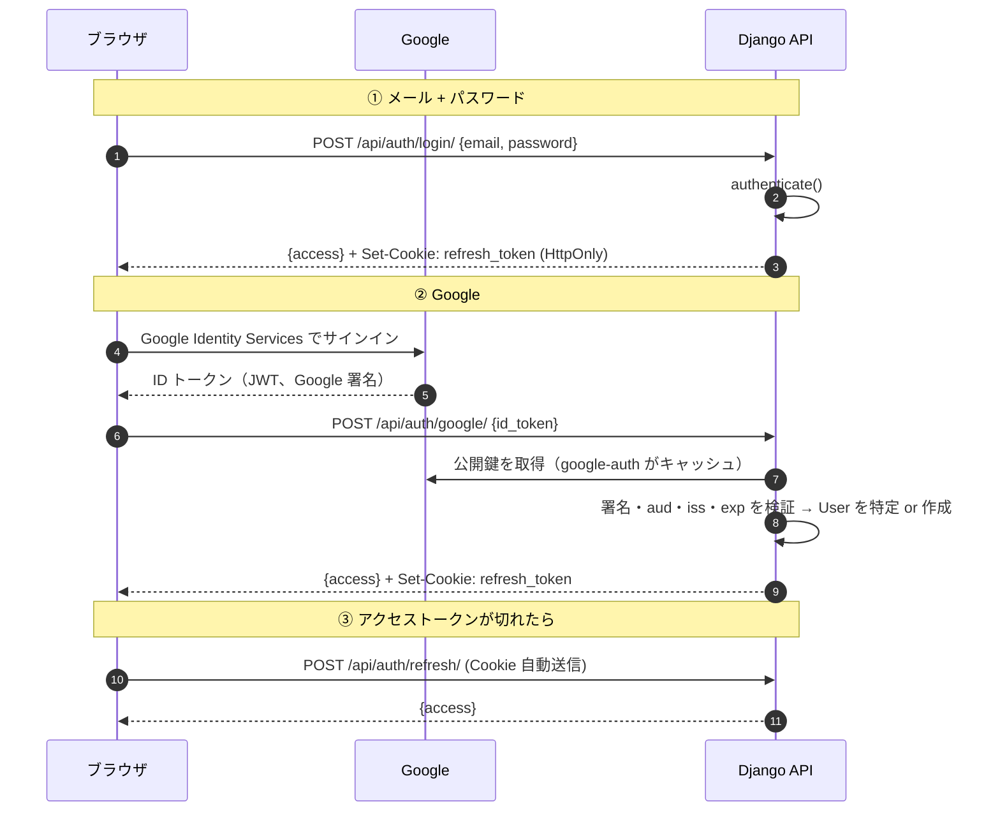

# 06. 認証設計（メール+パスワード / Google）

## 方針の要約

- **トークンは自前で発行する。** Google はあくまで「本人確認の手段」であって、Google のトークンをそのままアプリの認証に使わない。ID/PW でも Google でも、最終的にアプリが発行した JWT に合流する。
- **アクセストークン（短命 15 分）はメモリに、リフレッシュトークン（長命 14 日）は HttpOnly Cookie に。**
- **`django-allauth` は使わない。** 高機能だが、テンプレート前提の設計を SPA に噛ませると設定の学習コストが本題を上回る。`google-auth` で ID トークンを検証する数十行のほうが、何が起きているか見える。

## 全体フロー



## トークンの持ち方

| トークン | 保管場所 | 寿命 | 理由 |
|---|---|---|---|
| access | **JS のメモリ変数**（`localStorage` に置かない） | 15 分 | XSS で盗まれても被害が 15 分で切れる。リロードで消えるが、直後に refresh すれば復帰できる |
| refresh | **HttpOnly Cookie**（`Secure` / `SameSite=None` / `Path=/api/auth`） | 14 日 | JS から読めないので XSS で持ち出せない |

### なぜ `localStorage` にしないのか

`localStorage` は同一オリジンの JS から全部読める。依存ライブラリ 1 つが汚染されるだけでリフレッシュトークンが抜かれ、14 日間なりすませる。HttpOnly Cookie なら JS からは触れない。

**代わりに CSRF を考える必要が出る。** Cookie が自動送信される以上、`/api/auth/refresh/` は攻撃者のサイトからも叩けてしまう。ただし:

- レスポンスを読むにはクロスオリジンの制約を越える必要があり、`CORS_ALLOWED_ORIGINS` に載っていないオリジンからは**レスポンスを読めない**。
- Cookie の `Path=/api/auth` で送信先を絞る。
- それでも心配なら、refresh のレスポンスに CSRF トークンを載せてダブルサブミットする。**今回は CORS のオリジン制限までで止める**（練習の範囲として妥当）。

### Cookie の設定値

```python
# ローカル
REFRESH_COOKIE = dict(httponly=True, secure=False, samesite="Lax",  path="/api/auth")
# 本番（フロントと API が別ホストなので None が必須）
REFRESH_COOKIE = dict(httponly=True, secure=True,  samesite="None", path="/api/auth")
```

> **`SameSite=None` は `Secure` とセットでないとブラウザに捨てられる。** HTTPS でないと動かないので、ローカルでは `Lax` にする。この分岐を忘れると「ローカルではログイン維持されるのに、デプロイすると毎回ログアウトされる」になる。`02-architecture.md` の差分表の 1 行。

## Google ログインの実装

### Google Cloud Console 側の設定（Day 0 に済ませる）

1. プロジェクトを作る（**個人の Google アカウント配下で作る**。会社の Workspace 組織の下に作らない）
2. 「API とサービス」→「OAuth 同意画面」（新しいコンソールでは「Google Auth Platform」→ Branding / Audience / Clients）
   - **User Type は「外部（External）」**
   - 公開ステータスは「テスト」のまま。テストユーザーに自分のメールを追加
   - スコープは既定の `email` / `profile` / `openid` のみ。追加しない
3. 「認証情報」→「OAuth 2.0 クライアント ID」→ **ウェブアプリケーション**
4. **承認済みの JavaScript 生成元** に登録する:
   - `http://localhost:5173`
   - `https://<フロントの Render URL>`
5. **承認済みのリダイレクト URI は今回は不要**（後述の理由）
6. 発行された **クライアント ID** を控える。**クライアントシークレットは使わない**

> **フロントの Render URL は最初のデプロイをするまで分からない。** Day 0 では `localhost` だけ登録して進め、`08-deploy-render.md` の初回デプロイ後にここへ戻ってきて追加する。**この戻り忘れが「本番だけ Google ログインが動かない」の最頻出原因。**

### 「内部」ではなく「外部」を選ぶ理由

| | 内部（Internal） | 外部（External） |
|---|---|---|
| 前提 | **Google Workspace 組織が必要** | 誰でも |
| ログインできる人 | **その組織のアカウントのみ** | すべての Google アカウント |
| 審査 | 不要 | テストモードなら不要 |

内部にするとログインがその組織のアカウントに限定される。個人の練習プロジェクトなので**外部**を選ぶ。

**「テスト」モードのままだと、テストユーザーに登録したメールアドレスしかログインできない。** 誰かに見せる段階になったら「本番環境に公開」に切り替える。**今回は機微でない基本スコープ（`email` / `profile` / `openid`）しか使わないため、アプリ審査を通さずに公開できる。**

> 参考: テストモードでは Google の refresh token が 7 日で失効するが、**本構成では Google の refresh token を保存しない**（ログイン時に ID トークンを 1 回検証するだけで、以降はアプリ自前の JWT）。したがってこの制限の影響を受けない。

### なぜリダイレクト URI もシークレットも要らないのか

OAuth には大きく 2 つの流れがある。

| 方式 | 流れ | シークレット |
|---|---|---|
| Authorization Code フロー | ブラウザを Google にリダイレクト → コードを持って戻る → **サーバが**シークレット付きでトークンに交換 | 必要 |
| **ID トークン方式（今回）** | ブラウザ上で Google のライブラリがサインインを完結させ、**ID トークン（JWT）を直接返す**。それをサーバに渡して検証するだけ | 不要 |

SPA では後者が素直で、リダイレクトによる画面遷移も起きない。サーバがやることは「受け取った JWT が本当に Google の署名で、自分宛てで、期限内か」を確かめるだけ。

### フロント側

```html
<!-- index.html -->
<script src="https://accounts.google.com/gsi/client" async defer></script>
```

```ts
// 概念スケッチ
google.accounts.id.initialize({
  client_id: import.meta.env.VITE_GOOGLE_OAUTH_CLIENT_ID,
  callback: async (response) => {
    // response.credential が ID トークン
    const r = await api.post("/api/auth/google/", { id_token: response.credential });
    setAccessToken(r.access);
    setUser(r.user);
  },
});
google.accounts.id.renderButton(buttonRef.current, { theme: "outline", size: "large" });
```

### サーバ側の検証

```python
from google.oauth2 import id_token
from google.auth.transport import requests as google_requests

def verify(raw_token: str) -> dict:
    # 署名・exp・iss を検証し、aud が自分の client_id と一致することも確認する
    info = id_token.verify_oauth2_token(
        raw_token,
        google_requests.Request(),
        settings.GOOGLE_OAUTH_CLIENT_ID,   # ← aud のチェック。ここを渡さないと意味がない
    )
    if info["iss"] not in ("accounts.google.com", "https://accounts.google.com"):
        raise ValidationError("invalid issuer")
    if not info.get("email_verified"):
        raise ValidationError("email not verified")
    return info   # sub / email / name / picture など
```

**検証で必ず確認する 4 点**

| 項目 | 何を防ぐか |
|---|---|
| 署名（Google の公開鍵） | 偽造トークン |
| `aud` == 自分の client_id | **他のアプリ向けに発行されたトークンの使い回し**。ここが一番忘れられやすい |
| `iss` == `accounts.google.com` | 発行元のなりすまし |
| `exp` | 期限切れトークンの再利用 |

`verify_oauth2_token` は署名・`exp`・`aud` をまとめて見てくれる。`iss` と `email_verified` は自分で足す。

### ユーザーの特定 / 作成ロジック

```
info = verify(id_token)
sub, email = info["sub"], info["email"]

1. SocialAccount(provider="google", provider_uid=sub) があれば → その User でログイン
2. 無ければ、User(email=email) を探す
   2-a. 見つかった → 既存 User に SocialAccount を紐付けてログイン（created=False）
   2-b. 無い → User を新規作成（set_unusable_password）+ SocialAccount 作成（created=True）
```

**`sub` を主キー扱いにして `email` は補助にする。** Google のメールアドレスは変更されうるが `sub` は不変。`email` だけで突き合わせる実装にすると、ユーザーがメールを変えた瞬間に別アカウントが生えてしまう。

**2-a のアカウント自動紐付けについて。** 「同じメールなら同一人物」と見なして自動でリンクしている。これは `email_verified: true` を確認しているから成立する（Google が本人のメールだと保証している）。**検証していないメールでこれをやると、他人のアカウントを乗っ取れる典型的な脆弱性になる。** だから上のコードで `email_verified` を必ず見る。

## SimpleJWT の設定

```python
SIMPLE_JWT = {
    "ACCESS_TOKEN_LIFETIME": timedelta(minutes=15),
    "REFRESH_TOKEN_LIFETIME": timedelta(days=14),
    "ROTATE_REFRESH_TOKENS": True,        # refresh のたびに新しい refresh を発行
    "BLACKLIST_AFTER_ROTATION": True,     # 古い refresh を無効化
    "UPDATE_LAST_LOGIN": True,
    "AUTH_HEADER_TYPES": ("Bearer",),
    "USER_ID_FIELD": "id",
}
```

- `rest_framework_simplejwt.token_blacklist` を `INSTALLED_APPS` に入れる（ログアウトとローテーションに必要。テーブルが 2 つ増える）。
- **`refresh` の応答で Cookie を差し替える。** ローテーションを有効にした以上、新しい refresh を Cookie に書き戻さないと 2 回目の refresh が失敗する。
- SimpleJWT の標準ビューはトークンを body で受け渡す前提なので、**Cookie から読んで Cookie に書くカスタムビューを自分で書く**（20 行程度）。ここが今回の認証実装で一番手を動かす箇所。

## CORS の設定

```python
# production.py
CORS_ALLOWED_ORIGINS = [os.environ["FRONTEND_ORIGIN"]]   # https://xxx.onrender.com
CORS_ALLOW_CREDENTIALS = True                            # Cookie を送るために必須
CSRF_TRUSTED_ORIGINS = [os.environ["FRONTEND_ORIGIN"]]
```

```python
# local.py
CORS_ALLOWED_ORIGINS = ["http://localhost:5173"]
CORS_ALLOW_CREDENTIALS = True
```

- **`CORS_ALLOW_ALL_ORIGINS = True` は使わない。** `CORS_ALLOW_CREDENTIALS = True` と併用するとブラウザが拒否する（仕様上、ワイルドカードと認証情報は共存できない）ので、そもそも動かない。
- `corsheaders.middleware.CorsMiddleware` は **`CommonMiddleware` より前**に置く。順番を間違えるとプリフライトが 404 になる。

## フロント側のトークン更新

```ts
// api/client.ts の概念
let accessToken: string | null = null;

async function request(path: string, init: RequestInit = {}) {
  const res = await fetch(BASE + path, {
    ...init,
    credentials: "include",                       // Cookie を送る
    headers: { ...init.headers, ...(accessToken && { Authorization: `Bearer ${accessToken}` }) },
  });

  if (res.status !== 401) return res;

  // 401 → 一度だけ refresh を試す
  const ok = await refreshOnce();                 // 同時多発 401 を 1 回にまとめる（下記）
  if (!ok) { redirectToLogin(); throw new Error("unauthenticated"); }

  return fetch(BASE + path, { /* 同じ内容を再送 */ });
}
```

**注意点**

- **リトライは 1 回だけ。** refresh も 401 なら諦めてログイン画面へ。ここでループさせると無限リクエストになる。
- **同時に複数のリクエストが 401 になったとき、refresh を 1 回にまとめる。** 進行中の refresh の Promise を保持して共有する。これをやらないと refresh がローテーションと競合して、正しいトークンが無効化される。
- **アプリ起動時に一度 `refresh` を叩く。** access はメモリなのでリロードで消える。起動時に refresh して復帰させれば「リロードすると毎回ログアウトされる」を防げる。成功するまでの間はローディングを出す。

## 実装して分かったこと（Day 4 / 2026-08-03）

設計どおりに動いたが、**設計に書いていなかった落とし穴**が 5 つあった。

| 症状 | 原因 | 対処 |
|---|---|---|
| `google.auth.transport.requests` が `ModuleNotFoundError: requests` | **素の `google-auth` は HTTP クライアントを同梱していない。** 公開鍵の取得に使うトランスポートが extra に分かれている | `pyproject.toml` を **`google-auth[requests]`** にする。`uv.lock` も更新して commit |
| ログイン失敗が **401 ではなく 403** で返る | DRF の `APIView.handle_exception` は、`authentication_classes` が空のビューで `AuthenticationFailed` を受けると **403 に書き換える**（`WWW-Authenticate` ヘッダを組み立てられないため） | `status_code = 401` の `APIException` を自分で定義して投げる（`apps/accounts/exceptions.py`）。ログイン系は「期限切れの Authorization ヘッダに邪魔されない」よう意図して認証を外しているので、認証クラスを足して回避する道は採らない |
| `last_login` が更新されない | `SIMPLE_JWT["UPDATE_LAST_LOGIN"]` は **SimpleJWT 自身のシリアライザ**（`TokenObtainPairSerializer`）にしか効かない。`RefreshToken.for_user()` を直接呼ぶ実装では発火しない | ログイン成功時に `update_last_login(None, user)` を自分で呼ぶ |
| ログアウトしても本番だけ Cookie が残る（可能性） | `delete_cookie` に `samesite` を渡さないと、削除用の `Set-Cookie` に `Secure` が付かない。**`SameSite=None` かつ Secure 無しの Cookie はブラウザに捨てられる** | set と delete を同じ関数群（`apps/accounts/cookies.py`）に閉じ、`path` と `samesite` を必ず揃える |
| 大文字違いのメールで二重登録できてしまう | `unique=True` は大文字小文字を区別する。`Taro@` と `taro@` が別レコードとして通る | シリアライザで `email__iexact` を見て 400 にする（DB の `IntegrityError` = 500 にしない） |

### 本番で必ず確認すること（クロスサイト Cookie）

フロント（`xxx.onrender.com`）と API（`yyy.onrender.com`）は**別サイト**扱いになる
（`onrender.com` は Public Suffix List に載っているため、サブドメインどうしでも same-site にならない）。
つまりリフレッシュ Cookie は **third-party cookie** として扱われる。

- Chrome: `SameSite=None; Secure` で送られる。
- **Safari / ブラウザの「サードパーティ Cookie をブロック」設定では送られない。**
  → 「Chrome ではリロードでログインが維持されるのに、Safari では毎回ログアウトされる」になる。

**根本的な回避策は「API をフロントと同じサイトに置く」しかない**
（独自ドメインを取って `app.example.com` と `api.example.com` にする）。
今回は独自ドメインを使わないので、**この制限を受け入れる**。
`docs/10-roadmap.md` の動作確認シナリオは Chrome で通す前提。

> **Chrome では実測で通った**（PR #7 マージ後）。`Set-Cookie` は
> `SameSite=None; Secure; HttpOnly; Path=/api/auth` で出ており、登録 → F5 で
> `refresh` 200 → `me` 200、ログイン状態が維持される。**Safari は未検証。**

### 「本番だけ Google ログインが動かない」の切り分け順

原因が 3 か所に分かれるので、**上から順に潰すと速い**。

| 見えるもの | 原因 | 直す場所 |
|---|---|---|
| ボタンが描画されない | `VITE_GOOGLE_OAUTH_CLIENT_ID` がビルド時に入っていない（フロントの環境変数は**ビルド時に埋まる**） | Render の Static Site の環境変数 → **再ビルド** |
| Console に `[GSI_LOGGER]: The given origin is not allowed for the given client ID` | 承認済み JavaScript 生成元に本番 URL が無い（**最頻出**） | Google Cloud Console |
| ボタンは動くが API が **503** | サーバの `GOOGLE_OAUTH_CLIENT_ID` が空。`aud` を検証できないので**わざと止めている** | Render の Web Service の環境変数 |
| API が **401** | ここまでは正常。トークン側の問題（期限切れ・`aud` 不一致・未確認メール） | — |

**不正なトークンを 1 回投げて 401 か 503 かを見るだけで、サーバ側の設定切り分けが終わる。**

```bash
curl -sS -X POST https://<api>/api/auth/google/ \
  -H 'Content-Type: application/json' -d '{"id_token":"invalid"}' -w '\n%{http_code}\n'
```

### テストで気をつけたこと

- **DRF のスロットリングは cache にカウントを持つ。** cache はテスト間で共有されるので、
  クリアしないと「login を何度も叩くテストのせいで後続が 429」になる。
  落ち方が実行順に依存するので原因が分かりにくい。`conftest.py` に autouse の
  `cache.clear()` を置いた。
- **Django のテストクライアントは Cookie の `Path` を無視して全部送る。**
  `Path=/api/auth` が効いているかはテストでは検証できない。ブラウザで確認する。
- Google の署名検証は `google-auth` の責務なので、`verify_oauth2_token` を差し替えて
  **「検証を通った後の分岐」だけ**をテストする。差し替え関数の中で
  `audience == client_id` を assert しておくと、`aud` チェックの引数を
  渡し忘れる回帰を捕まえられる。

## セキュリティ上、今回やらないこと（意識的に）

| 項目 | 判断 |
|---|---|
| メールアドレスの確認（確認メール） | SMTP 設定が本題から外れる。登録直後から使える |
| パスワード再設定 | 同上 |
| 2 要素認証 | スコープ外 |
| refresh の CSRF ダブルサブミット | CORS のオリジン制限で止める |
| ログイン試行のアカウントロック | DRF のスロットリング（IP ベース）まで |

**これらは「知らなかった」ではなく「今回はやらないと決めた」もの。** 実サービスに転用するときは、この表を上から潰していく。
