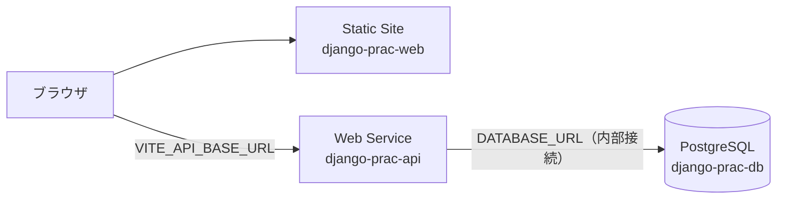

# 08. Render.com へのデプロイ

## 前提と注意

> **無料枠の条件は 2026-08-03 に確認済み**（`00-decisions.md`）。料金体系は変わりやすいので、実際に作成する直前に [Render の無料枠ドキュメント](https://render.com/docs/free) をもう一度見ること。

## 構成

Render 上に **3 つのリソース**を作る。

| リソース | 種別 | 中身 | 無料枠での挙動 |
|---|---|---|---|
| `django-prac-web` | **Static Site** | React のビルド成果物（`dist/`） | スリープしない。常に速い |
| `django-prac-api` | **Web Service（Docker）** | Django + Gunicorn | **15 分アクセスが無いとスリープ**。復帰に数十秒 |
| `django-prac-db` | **PostgreSQL** | | **作成から 30 日で失効 → 14 日の猶予 → データごと削除。** 1 GB / アカウントあたり 1 個 / バックアップ非対応 |



### 無料枠で必ず踏む 2 つの落とし穴

**1. API のコールドスタート**

無料の Web Service は無操作 15 分でスリープし、次のリクエストで起動し直す。**最初の API 呼び出しが 30〜60 秒待たされる。**

対策:
- フロント側で、初回リクエストのタイムアウトを長め（60 秒）に取る
- 起動中と分かるローディング表示を出す（「サーバーを起動しています…」）
- 人に見せる直前に一度アクセスして温めておく

**根本的には有料プランに上げるしか解決しない。** 練習用途なので受け入れる。

**2. 無料 PostgreSQL の 30 日制限**

| 条件 | 内容 |
|---|---|
| 有効期限 | **作成から 30 日** |
| 猶予期間 | 失効後 **14 日**。この間に有料へ上げなければ**データごと削除** |
| 容量 | 1 GB |
| 個数 | **アカウントあたり同時に 1 つまで** |
| バックアップ | **非対応** |

対策:
- **データを失っても復旧できる状態を保つ。** それが `04-data-model.md` で fixture を commit している理由。DB を作り直したら `migrate` + `loaddata` で元に戻る
- ユーザーアカウントは消える。練習用なので許容する
- **作成日から 30 日後をカレンダーに入れておく。** Render からメール通知も来る
- 期限が来たときの手順は `10-roadmap.md` の運用メモに書いてある

> **「無料 DB は 1 アカウント 1 個」なので、dev / prod の DB 分離はできない。** 本番 1 本で進める。ローカルの compose の Postgres が実質的な dev 環境になる。

## `render.yaml`（Blueprint / IaC）

管理画面でポチポチ作らず、リポジトリの `render.yaml` から作る。**構成が誰にでも読める形で残り、作り直しも一発**になる。

```yaml
databases:
  - name: django-prac-db
    databaseName: django_prac
    user: django_prac
    plan: free
    region: singapore                 # ★ API と同じリージョンにすること

services:
  # --- Django API ---
  - type: web
    name: django-prac-api
    runtime: docker
    plan: free
    region: singapore                 # 日本から近いリージョンを選ぶ
    rootDir: backend
    dockerfilePath: ./Dockerfile
    autoDeploy: false                 # ← CI 経由でだけデプロイする（09-ci-cd.md）
    healthCheckPath: /api/health/
    dockerCommand: >
      sh -c "python manage.py migrate --noinput &&
             python manage.py collectstatic --noinput &&
             gunicorn config.wsgi:application --bind 0.0.0.0:$PORT --workers 2"
    envVars:
      - key: DJANGO_SETTINGS_MODULE
        value: config.settings.production
      - key: DJANGO_SECRET_KEY
        generateValue: true           # Render が生成して保持する
      - key: DATABASE_URL
        fromDatabase:
          name: django-prac-db
          property: connectionString
      - key: DJANGO_ALLOWED_HOSTS
        sync: false                   # 初回デプロイ後に手で入れる
      - key: FRONTEND_ORIGIN
        sync: false                   # 同上
      - key: GOOGLE_OAUTH_CLIENT_ID
        sync: false

  # --- React フロント ---
  - type: web
    name: django-prac-web
    runtime: static
    plan: free
    rootDir: frontend
    buildCommand: npm ci && npm run build
    staticPublishPath: ./dist
    autoDeploy: false
    envVars:
      - key: VITE_API_BASE_URL
        sync: false                   # 初回デプロイ後に API の URL を入れる
      - key: VITE_GOOGLE_OAUTH_CLIENT_ID
        sync: false
      - key: VITE_GOOGLE_MAPS_API_KEY
        sync: false                   # ⚠ 課金に直結。リファラー制限を掛けてから入れる
      - key: VITE_GOOGLE_MAPS_MAP_ID
        sync: false
    routes:
      - type: rewrite                 # ← SPA のクライアントルーティングに必須
        source: /*
        destination: /index.html
    headers:
      - path: /*
        name: X-Frame-Options
        value: DENY
```

### 各設定の意図

| 設定 | なぜ |
|---|---|
| `dockerCommand` で `migrate` を実行 | Render の `preDeployCommand` は有料プラン向けの機能。無料枠では**起動コマンドの先頭でマイグレーションを流す**のが素直。複数インスタンスに増やすときは分離が必要になるが、`workers 2` の単一インスタンスなら問題ない |
| `autoDeploy: false` | Render 標準の「push したら即デプロイ」を切る。**テストが落ちてもデプロイされてしまう**のを防ぐため。代わりに GitHub Actions が成功したときだけ Deploy Hook を叩く |
| `healthCheckPath` | Render がここを叩いて起動完了を判定する。**DB に触らない軽いエンドポイントにする**こと |
| `routes: rewrite` | これが無いと `/login` を直接開いたときに 404 になる（SPA の典型的な事故） |
| `sync: false` | 「Blueprint では管理せず、ダッシュボードで手入力する」の意味。URL のように**初回デプロイまで確定しない値**に使う |
| `generateValue: true` | `SECRET_KEY` を Render 側で生成させる。リポジトリにも手元にも平文が残らない |
| `region: singapore` | 日本からのレイテンシを抑える。**DB と API は必ず同じリージョンにする**（別リージョンだと内部接続にならない） |

## 環境変数の一覧

### API（`django-prac-api`）

| 変数 | 値 | 出所 |
|---|---|---|
| `DJANGO_SETTINGS_MODULE` | `config.settings.production` | `render.yaml` |
| `DJANGO_SECRET_KEY` | ランダム | Render 生成 |
| `DATABASE_URL` | `postgres://...` | Render の DB から自動 |
| `DJANGO_ALLOWED_HOSTS` | `django-prac-api.onrender.com` | **初回デプロイ後に手入力** |
| `FRONTEND_ORIGIN` | `https://django-prac-web.onrender.com` | **初回デプロイ後に手入力** |
| `GOOGLE_OAUTH_CLIENT_ID` | Google Cloud の値 | 手入力 |
| `PORT` | Render が自動で注入 | — |

### フロント（`django-prac-web`）

| 変数 | 値 |
|---|---|
| `VITE_API_BASE_URL` | `https://django-prac-api.onrender.com` |
| `VITE_GOOGLE_OAUTH_CLIENT_ID` | Google Cloud の値 |
| `VITE_GOOGLE_MAPS_API_KEY` | Google Cloud の値。**入れる前に Cloud Console でリファラー制限に本番 URL（`https://django-prac-web.onrender.com/*`）を追加する** |
| `VITE_GOOGLE_MAPS_MAP_ID` | 自前の Map ID。未設定なら `DEMO_MAP_ID` が使われる |

> **フロントの環境変数はビルド時に埋め込まれる。** 変更したら**必ず再デプロイ（再ビルド）する**こと。環境変数を書き換えただけでは反映されない — Static Site 特有の引っかかりポイント。

## `production.py` で必要な設定

```python
from .base import *

DEBUG = False
ALLOWED_HOSTS = os.environ["DJANGO_ALLOWED_HOSTS"].split(",")

# --- CORS / CSRF（フロントが別ホストなので必須）---
FRONTEND_ORIGIN = os.environ["FRONTEND_ORIGIN"]
CORS_ALLOWED_ORIGINS = [FRONTEND_ORIGIN]
CORS_ALLOW_CREDENTIALS = True
CSRF_TRUSTED_ORIGINS = [FRONTEND_ORIGIN]

# --- Render のプロキシ配下で HTTPS を正しく認識させる ---
SECURE_PROXY_SSL_HEADER = ("HTTP_X_FORWARDED_PROTO", "https")
SECURE_SSL_REDIRECT = True
SESSION_COOKIE_SECURE = True
CSRF_COOKIE_SECURE = True
SECURE_HSTS_SECONDS = 3600

# --- Cookie（06-auth.md）---
REFRESH_COOKIE_SECURE = True
REFRESH_COOKIE_SAMESITE = "None"

# --- 静的ファイル（Django Admin 用）---
STATIC_ROOT = BASE_DIR / "staticfiles"
STORAGES = {
    "staticfiles": {"BACKEND": "whitenoise.storage.CompressedManifestStaticFilesStorage"},
}
MIDDLEWARE.insert(1, "whitenoise.middleware.WhiteNoiseMiddleware")

# --- ログ（Render のログビューアに出す）---
LOGGING = { ... }   # console ハンドラに INFO 以上
```

**`SECURE_PROXY_SSL_HEADER` を入れ忘れると `SECURE_SSL_REDIRECT` が無限リダイレクトになる。** Render は TLS を終端してから HTTP でコンテナに渡すので、Django からは「HTTP で来ている」ように見え、HTTPS へリダイレクト → また HTTP で届く、を繰り返す。**この 2 行はセットで書く。**

## 初回デプロイの手順

順番が重要。**URL が確定してからでないと入れられない値がある**ので、2 周する形になる。

```
1.  GitHub にリポジトリを push する
2.  Render で New → Blueprint → リポジトリを選択 → render.yaml が読まれる
3.  DB / API / Static Site の 3 つが作られる（この時点では API は起動失敗してよい）
4.  ★ 発行された URL を 2 つ控える
      API   : https://django-prac-api.onrender.com
      フロント: https://django-prac-web.onrender.com
5.  API の環境変数に入力
      DJANGO_ALLOWED_HOSTS   = django-prac-api.onrender.com
      FRONTEND_ORIGIN        = https://django-prac-web.onrender.com
      GOOGLE_OAUTH_CLIENT_ID = （Google Cloud の値）
6.  フロントの環境変数に入力
      VITE_API_BASE_URL             = https://django-prac-api.onrender.com
      VITE_GOOGLE_OAUTH_CLIENT_ID   = （同上）
      VITE_GOOGLE_MAPS_API_KEY      = （Maps のキー。先に手順 7 の制限を入れる）
      VITE_GOOGLE_MAPS_MAP_ID       = （未作成なら空でよい = DEMO_MAP_ID）
7.  ★ Google Cloud Console に戻り、本番 URL を 2 か所に追加する
      - OAuth:「承認済みの JavaScript 生成元」に https://django-prac-web.onrender.com（06-auth.md の宿題）
      - Maps のキー:「HTTP リファラー制限」に https://django-prac-web.onrender.com/*
        （制限に本番 URL が無いと、本番で地図が RefererNotAllowedMapError になる）
8.  両方を Manual Deploy で再デプロイ
9.  ★ 初期データを投入する。**無料プランは Shell が使えない**ので、
      External Database URL を使ってローカルから流す（後述「本番 DB に外部から接続する」）
        docker compose exec -T -e DATABASE_URL="<external url>?sslmode=require" \
          api python manage.py loaddata libraries
10. 動作確認（下のチェックリスト）
11. GitHub Actions 用に Deploy Hook の URL を 2 本取得（09-ci-cd.md）
```

> **手順 4 → 5・6・7 が「URL が決まらないと入れられない値」。** ここを飛ばして「なぜか本番だけ動かない」になるのが定番なので、初回は必ずこの順で進める。

## デプロイ後チェックリスト

`02-architecture.md` の差分表と対応している。上から順に潰す。

- [ ] `https://<api>.onrender.com/api/health/` が `200` を返す
- [ ] `https://<api>.onrender.com/admin/` が**CSS ありで**表示される → WhiteNoise が効いている
- [ ] フロントを開いて地図が表示される → Maps のキーとリファラー制限が正しい
      （出ない場合は Console のエラーを見る: `InvalidKeyMapError` / `RefererNotAllowedMapError` / `BillingNotEnabledMapError`）
- [ ] 図書館のピンが表示される → **CORS が通っている**（DevTools の Console にエラーが無い）
- [ ] `/login` を**ブラウザで直接開いて** 404 にならない → `routes: rewrite` が効いている
- [ ] メール + パスワードで登録・ログインできる
- [ ] **ページをリロードしてもログイン状態が維持される** → `SameSite=None; Secure` の Cookie が効いている
- [ ] Google ログインができる → JavaScript 生成元の登録が済んでいる
- [ ] 「現在地」ボタンが動く → HTTPS なので Geolocation が使える
- [ ] 無限リダイレクトしていない → `SECURE_PROXY_SSL_HEADER`
- [ ] Render のログにエラーが出ていない
- [ ] **`/api/libraries/` がデータを返す** → `count: 0` なら DB が空。下の「本番 DB へのシード投入」へ

## 本番 DB に外部から接続する

**Render の Postgres は External Database URL で外部から直接つながる。**
無料プランは Shell 接続が使えないが、これがあれば実質的に何でもできる。
シードの投入も、バックアップも、調査も、すべてここから行う。

### 3 つの接続文字列の違い

Render のダッシュボード（対象の DB → Connections）に 3 つ並んでいる。

| | 用途 |
|---|---|
| **Internal Database URL** | **Render 内の同一リージョンのサービス間**。API が使うのはこれ（`render.yaml` の `fromDatabase` が自動で注入する）。外からは繋がらない |
| **External Database URL** | **外部から**。TLS 必須。手元の作業はこれを使う |
| **PSQL Command** | `render` CLI 経由で psql を開く |

> **DB と API を同じリージョンに置くのはこのため。** 別リージョンだと Internal で
> 繋がらず、外部経由になって遅くなる（`render.yaml` の `region` 参照）。

### 使い方

```bash
DB="postgresql://<user>:<password>@<host>.singapore-postgres.render.com/<db>?sslmode=require"
```

**`?sslmode=require` を付ける。** Render の外部接続は TLS 必須。

#### 1. 任意の manage.py コマンドを本番に対して流す

ローカルの `api` コンテナから、接続先だけ差し替える。

```bash
docker compose exec -T -e DATABASE_URL="$DB" api python manage.py loaddata libraries
docker compose exec -T -e DATABASE_URL="$DB" api python manage.py createsuperuser
docker compose exec -it -e DATABASE_URL="$DB" api python manage.py shell
```

#### 2. バックアップを取る（無料プランで唯一の手段）

**無料 Postgres はバックアップ非対応**なので、必要なら自分で取るしかない。

```bash
docker compose exec -T -e DATABASE_URL="$DB" api python manage.py dumpdata \
    libraries accounts --indent 1 > backup.json
```

`pg_dump` を使うなら Postgres クライアントの入ったコンテナから:

```bash
docker run --rm postgres:16-alpine pg_dump "$DB" > backup.sql
```

**30 日の失効前に取っておくと、新しい DB に流し直せる。**

#### 3. GUI クライアント / psql で直接覗く

DataGrip や TablePlus に External URL をそのまま貼れば繋がる（SSL を有効にする）。
クエリを直接叩いて調査できる。

```bash
docker compose exec -T db psql "$DB" -c "select count(*) from libraries_library;"
```

### 注意

| | |
|---|---|
| **本番に直結している** | `migrate` / `flush` / `DELETE` は取り返しがつかない。**無料プランにバックアップは無い** |
| **接続文字列は認証情報** | ファイルに書かず、その場のコマンド引数としてだけ使う。誤って共有したら Render でパスワードをローテーションする |
| ローテーション後 | `DATABASE_URL` は `fromDatabase` で自動注入されるので、**API 側は設定変更なしで追従する**。再デプロイだけでよい |

## シードの投入（上記の応用）

**デプロイしてもデータは入らない。** 起動コマンドで走るのは `migrate` と
`collectstatic` だけで、`loaddata` は含まれていない。

```
症状: GET /api/libraries/ が {"count":0,"truncated":false,"results":[]} を返す
      → エンドポイントは出ている（= コードは反映済み）が、DB が空
```

```bash
docker compose exec -T -e DATABASE_URL="$DB" api python manage.py loaddata libraries
curl -sS "https://<api>.onrender.com/api/libraries/?limit=500" | head -c 40
# → {"count":490,"truncated":false,...}
```

### 起動コマンドに `loaddata` を入れなかった理由

`dockerCommand` に足せば自動化できそうに見えるが、**無料プランでは悪手**。

無料 Web Service は 15 分でスリープし、**起きるたびにコンテナが再起動して
起動コマンドが再実行される。** つまり起床のたびに 490 行を書き直すことになる。
1 日に何十回も起こりうる。

fixture の pk は固定なので重複はしないが、無駄な書き込みが増えるだけ。

### 30 日ごとに再投入が必要

無料 Postgres は 30 日で失効し、猶予 14 日の後にデータごと消える。
新しい DB を作ったら上のコマンドをもう一度流す。

自動化したい場合は **「テーブルが空のときだけシードする」** コマンドを作って
起動コマンドに足す。起動ごとのコストは `SELECT EXISTS` 1 回で済むので、
上記の問題を避けつつ DB 再作成に自動で追従できる。

## よくあるエラーと原因

| 症状 | 原因 |
|---|---|
| **リクエストの半分くらいが 404 になる**（ログにはエラーが出ていない） | **ヘルスチェックと `SECURE_SSL_REDIRECT` の衝突。** 下記 |
| API は動くが `count: 0` しか返らない | **DB にシードを入れていない。** デプロイでは `loaddata` は走らない（上記） |
| `DisallowedHost at /` | `DJANGO_ALLOWED_HOSTS` 未設定 or ホスト名が違う |
| ブラウザ Console に `blocked by CORS policy` | `FRONTEND_ORIGIN` の値が違う（末尾スラッシュが余計、`http`/`https` の取り違え） |
| リダイレクトが多すぎる | `SECURE_PROXY_SSL_HEADER` の設定漏れ |
| Admin が CSS 無しの素の HTML | `collectstatic` が走っていない / WhiteNoise ミドルウェア未登録 |
| リロードでログアウトされる | Cookie が `SameSite=Lax` のまま（本番は `None; Secure`） |
| `/login` を直接開くと 404 | Static Site の `routes: rewrite` が無い |
| Google ログインで `origin_mismatch` | Google Cloud に本番の生成元を登録していない |
| 起動時に `relation does not exist` | `migrate` が走っていない（`dockerCommand` を確認） |
| デプロイは成功するのに反映されない | フロントの環境変数を変えただけで再ビルドしていない |
| 突然 DB に繋がらなくなった | **無料 Postgres の有効期限切れ** |

## ★ 実際に踏んだ罠: ヘルスチェックと HTTPS リダイレクトの衝突

**症状**: デプロイは成功し、ログもクリーン（クラッシュもヘルスチェック失敗の記録もない）。
なのに**外から叩くとリクエストの約半分が 404** になる。

```
$ for i in 1..15; curl -o /dev/null -w "%{http_code}" .../api/health/
X...XXXXX.XXXXX      成功 4 / 失敗 11
```

**切り分けの決め手は `x-render-origin-server` ヘッダ。**

| ヘッダ | 意味 |
|---|---|
| `x-render-origin-server: gunicorn` | アプリまで届いている。**レスポンスは正しい** |
| `x-render-routing: no-server` | Render のエッジが**生きているインスタンスを見つけられなかった** |

この 2 つがリクエストごとにランダムに入れ替わる。**プロセスは動いているのに、
インスタンスがルーティングから出たり入ったりしている**状態。

**原因**

```
Render の内部ヘルスチェックが X-Forwarded-Proto を付けずにコンテナを叩く
  → Django は「HTTP で来た」と判断し SECURE_SSL_REDIRECT で 301 を返す
  → Render は 2xx でないため失敗と見なしインスタンスをルーティングから外す
  → 次の試行では通るのでまた投入される
  → 以降フラッピング
```

**アプリケーションログには何も出ない。** ヘルスチェックはアプリのログではなく
プラットフォーム側の判定なので、`django.request` のログにも現れない。

**対処**

```python
# production.py
SECURE_REDIRECT_EXEMPT = [r"^api/health/$"]
```

先頭にスラッシュを付けないこと。Django は `path.lstrip("/")` した後の値と照合する。

**確認方法**（ローカルで再現できる）

```python
# X-Forwarded-Proto を付けずに叩く = 内部ヘルスチェックの再現
c.get("/api/health/")   # 修正前 301 → 修正後 200
c.get("/admin/")        # 301 のまま（意図通り）
```

> **教訓**: 「デプロイ成功 + ログがクリーン」でも壊れていることがある。
> **外形監視（実際に URL を叩く）を必ずやる**こと。デプロイ後チェックリストが
> 単なる儀式ではないのはこのため。

## 独自ドメインについて

元プロジェクトの検討メモに「ドメインを買うか」の論点があった。**この練習用リポジトリでは買わない。**

- `*.onrender.com` のままで機能上の問題は一切ない
- 独自ドメインを当てると、Google OAuth の生成元・`ALLOWED_HOSTS`・`FRONTEND_ORIGIN`・CORS を**全部書き換える**ことになる
- ドメインを当てる練習をしたくなったら、上の 4 箇所を直せばよいと分かっている状態がゴール。実際に買う必要はない
